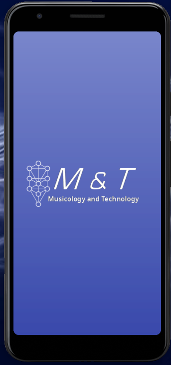
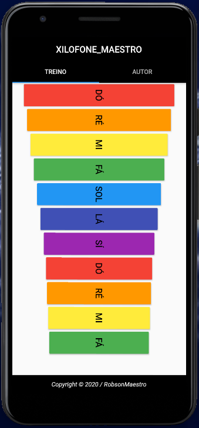
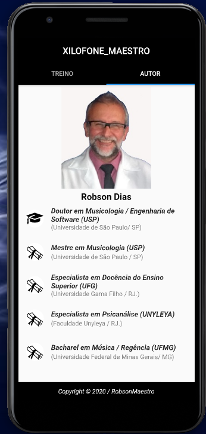

## Projeto Xilofone Maestro
 O projeto xilofone Maestro foi desenvolvido em 2020 para atender os alunos do Colégio SESC unidade Araxá na disciplina música.

 As cores adotadas para as teclas do Xilofone virtual obedecem a ordem existente nos instrumentos físicos da escola (Cores do Arco-Iris) não sendo possível adotar outros aplicativos disponíveis sem prejuízo didático.
 ## Telas da Aplicação
 
 
 

 O Aplicativo foi retirado da playstore no final do ano. A tela de abertura continha o logotipo do SESC sendo subistituída nesta versão pelo logotipo do meu [canal do youtube](https://www.youtube.com/channel/UCOaYIlm1AaY4ErmcxeCRzOA).
